# 프로젝트 명
Daily Box Office TOP10 

# 프로젝트 설명
  오픈API를 이용해 영화 박스오피스를 시각화한 어플리케이션

## 전체적인 프로젝트 요약과 구현방법 

<b> 사전에 준비할 것</b>

    영화의 일일 박스오피스 순위의 정보를 가지고있는 오픈API, URL과 Key를 "영화권입장권통합전산망"에서 제공받는다.

    영화권입장권통합전산망 오픈API 페이지 : http://www.kobis.or.kr/kobisopenapi/homepg/apiservice/searchServiceInfo.do
    
<b>JSON형식의 데이터 예시</b>
   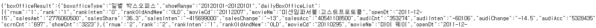</img>
   
   
 <b>프로젝트 구현 전, 요약</b>

전체 프로젝트를 요약하면 , url을 가지고 입력상자에 사이트 주소를 넣고 요청하기 버튼을 클릭하면 웹서버가 요청되는데 이때 Volley가 요청과 응답을 단순화하여 응답을 받아온다. 받아온 응답은 json형식의 데이터로, 이를 gson통해 자바 객체로 바꿔 그 안에 있는 데이터를 하나씩 꺼내 어댑터에 추가한다. 그 후 어댑터에 리싸이클러뷰 객체를 설정하여 리스트형식으로 시각화하여 박스오피스 정보를 나타내는 프로젝트이다.
 
 <b>프로젝트 구현 시작 </b> 
 
이를 시작하기 위해선 웹서버에 요청하고 응답받을 때 volley를 사용하기 때문에 volley라이브러리 추가를 꼭 해야한다. 추가 후 응답을 받기 위해서는 Request 객체를 만들어 이 객체를 RequestQueue에 넣어주면 큐가 알아서 웹서버에 요청하고 응답까지 받아준다.

이 후 웹 응답으로 받은Json 결과물을 처리하기 위해 gson을 라이브러리에 추가한다.  이때 gson은 JSON문자열을 자바 객체로 만들어 그 안에 있는 데이터를 사용할 수 있게 해준다.
하지만 JSON을 자바 객체로 바꿀 때도 클래스를 정의해야 한다. 이때 생성한 클래스를 MovieList로 정한다.

<b>실제MovieList클래스에 적은 코드</b>

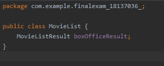</img>

MovieList 안에 boxofficeResult라는 변수를 선언해야한다. 이때 주의할 점은 JSON문자열에서 속성의 이름과 같아야 한다.
[MovieListResult는 boxofficeResult를 담아둘 클래스를 정의한 것]

<b>실제MovieListResult클래스에 적은 코드</b>

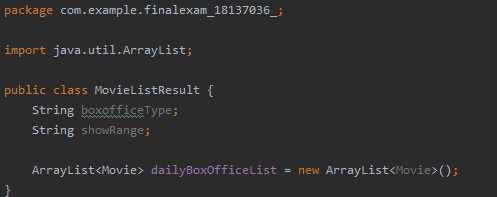</img>

 위에서 만든  boxofficeResult를 담아두기 위해 만든 MovieListResult안에는 배열 안에 다시 객체들이 들어가는 경우를 해당 객체들을 위한 클래스로 ArrayList까지 만든다.

<b>실제Movie클래스에 적은 코드</b>

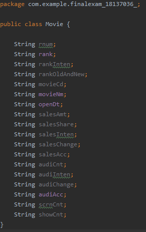</img>

마지막 Movie 클래스에서는 JSON문자열 형식의 영화정보를 입력해야한다. 

이제 이것들을 화면에 리스트 모양으로 보여주기 위한 작업을 해야한다. activity_main.xml 파일에 recyclerview를 추가하고 이를 관리할 어댑터를 만들기 위해 MovieAdapter라는 클래스를 생성한다.

<b>실제MovieAdaptet 클래스에 적은 코드</b>

</img>

클래스를 만들었으면 그 안에 ViewHoler 클래스를 static으로 정의하고 리스트 형태로 보일 때 ViewHoler에 movie의 객체가 담기게 된다.

ViewHole에 넣어 줄 뷰 객체의 XML 레이아웃은 movie_item 이라고 정하고 보여지게 할 화면을 cardview 사용하여 만든다.

<b>실제 movie_item.xml cardview 코드</b>

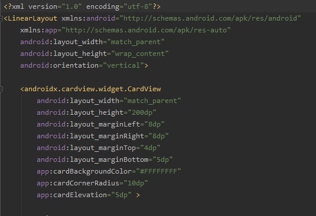</img>

cardView는 layout_margin 값을 주어 테두리가 띄어지게 만들 수 있다.

이제 아까 만든  MovieAdaptet 클래스가 recyclerview.adapter 클래스를 상속하도록 수정하고 recyclerview와 adater가 상호작용하면서 리스트모양으로 보여준다. 마지막으로 요청하기를 눌렀을 떄  리싸이클러뷰에 보여주는 과정으로 onCreate() 메서드 안에 button과 Listener 를 추가하고 Volley의  RequestQueue  생성하는 코드를 추가히거 메서드들을 순서대로 정의한다.

그 후 사용자가 버튼을 누르면 응답을 받으면 OnResponse()메서드 안에서 processResponse() 메서드를 호출하고  processResponse() 메서드 안에서는 Gson을 이용해 Json 문자열을 MovieList 객체로 변환하여 그 안에 들어있는 객체를 Movie 객체들을 하나씩 꺼내어 어댑터에 추가한다. 

<b>실제 MainActivity processResponse 코드</b>

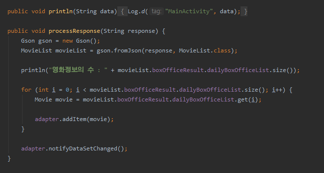</img>

## 응용한 부분

### RecyclerView , caraView  구현

activity_main.xml RecyclerView를 화면에 끌어와 다운로드를 진행한다 + caraView 도 같은 방법

### 중복 LinearLayout구현

중복 레이아웃이아웃은 하나의 레이아웃 안에 레이아웃을 여러개 만드는 걸 말한다.
프로젝트 안에서도 사용된 레이아웃은 총 6개로 중복 레이아웃을 통해서 수평 수직 배열의 형태로 지정할 수 있다. 

### TextView구현 

프로젝트 안에 작성한 TextView는 총5가지다. TextView1는 영화순위, TextView2는 영화제목, TextView3는 개봉일 , TextView4는 일별 관람객 수 TextView5는 누적 관람객 수를 보여주도록 만들었는데, 이는 RecyclerView 에서 상속을 받아 ViewHolder생성한 후 각각의 데이터를 받아 TextView로 표시를 해주는 방식으로 진행했다. 구현 하기 위해서는 MovieAdapter.java 페이지에서 작성하며 findViewById(R.id.textview); 코드를 입력해 xml과 연결시켜줘야한다. 

<b>TextView 꾸미기</b>

>1)android:textStyle="bold" 

>2)android:textColor="#E10B0B"

영화순위와 영화제목은 1)과 같이 textStyle 중에 bold 로 선택해 글씨를 굵게 표현하였고 일별 관람객 수와 누적 관람객 수에는 2)와  textColor를 지정해 글씨를 붉은색으로 지정했다.

### Button 구현

>public void B1(View V)

>{ Intent myIntent = new Intent(Intent.ACTION_VIEW, Uri.parse("이동할 페이지의 url 입력"));
   startActivity(myIntent);}

이 프로젝트에서의 버튼 두 개의 역할은 웹페이지 이동에 목적을 두고있다.
button1은 kobis mobile 페이지로, button2는 kobis mobile 최신상영작 페이지로 이동하는데 button 구현하는 방법은 OnClick 했을 때 불러올 함수를 지정하는 것이다. button1의 OnClick의 함수는 B1 으로 지정하고 button2의 OnClick의 함수는 B2로 지정했다. 그 후 MainActivity로 가서 button1의 OnClick의 함수인 B1을 호출하고 Intent 함수를 myIntent로 불러 위와 같은 코드를 작성한다. button2도 같은 방법으로 작성 가능하다.( 단,  button2의 함수는 B2)

### imeageView 구현

>app:srcCompat="@drawable/이미지이름" 

영화와 관련된 이미지가 어떤것이 있을까 고민하다가 영화하면 빠질 수없는 팝콘이 생각나, 무료 이미지제공 사이트에서 다운받아 res - drawavble에 팝콘이미지를 넣어준다. 그 후 이미지를 구현할 레이아웃인 movie_item 에서 ImageView를 추가하고 아래와 같은 코드를 작성한다.

- ### 주의 할 점

1. 앱이 인터넷 권한을 사용하므로 아래의 코드로 AndroidManifest.xml 에서 권한을 추가한다.

>uses-permission android:name="android.permission.INTERNET"

2. 그 후 <application> 안에 아래와 같은 속성을 추가한다.
   
>android:usesCleartextTraffic="true"

3.Gson은 JSON 문자열을 자바 객체로 변환해주고 Volley를 사용해서 웹서버로부터 JSON응답을 받아야 한다. 둘 다 외부라이브러리이기 때문에 사용하려면 build.gradle(Module:app) 라이브러리에 아래와 같은 코드를 추가해야한다.

>implementation 'com.android.volley:volley:1.1.0'

>implementation 'com.google.code.gson:gson:2.8.5'

4. activity_main.xml 에서 text 속성 값에 사이트 URL을 미리 넣어 둘 때, URL이 XML 레이아웃 안에 들어갈 때는 & 기호를 인식하지 못하므로 &#38; 기호로 바꾸어 넣어줘야 한다.

>예시 ) c3ca0e&;targetDt=20200101  -> c3ca0e&#38;targetDt=20200101

## 위에 내용을 응용하여 바뀐 디자인

<b>1.웹 요청 화면 </b>

<b>(왼쪽) 기존 화면  (오른쪽) 변경 화면</b>

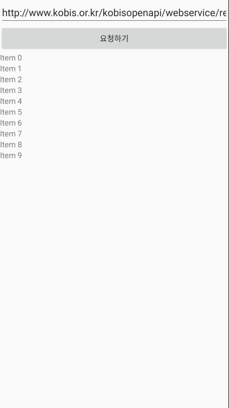</img>
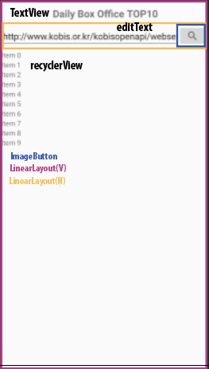</img>

이 프로젝트 명인 Daily Box Office TOP10 맨 위 상단에 textview로 나타내고 기존에 자리를 많이 차지했던 요청하기 버튼을 imageButton으로 돋보기 모양으로 변경하여 정보를 나타낼 수 있는 공간을 확보했다. 

<b>2.정보 시각화 화면</b>

<b>(위) 기존 화면  (아래) 변경 화면</b>

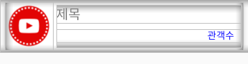</img>

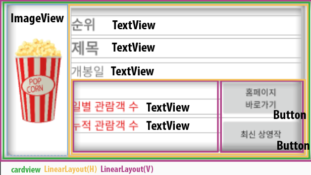</img>

기존에는 영화의 제목과 관객수만 보이는 단순한 구조였다면 , 순위,  개봉일을 추가하고 일별 관람객과 누적 관람객으로 나눠 표시하도록 만들었다. 
그 후 모바일 홈페이지와 최신상영작페이지로 바로갈 수 있는 버튼 두 개를 만들어 사용자들이 더욱 편리하게 사용 가능하도록 바꾸었다.

## 결과 화면

<b>(오른쪽) 웹 요청 화면 (왼쪽) 요청받아 시각화 된 화면 </b>

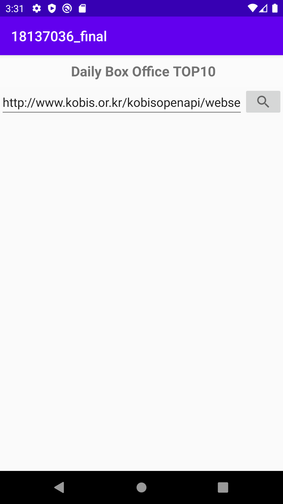</img>
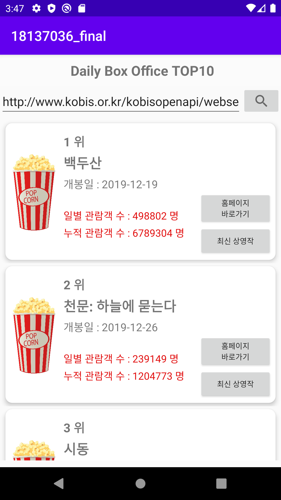</img>

