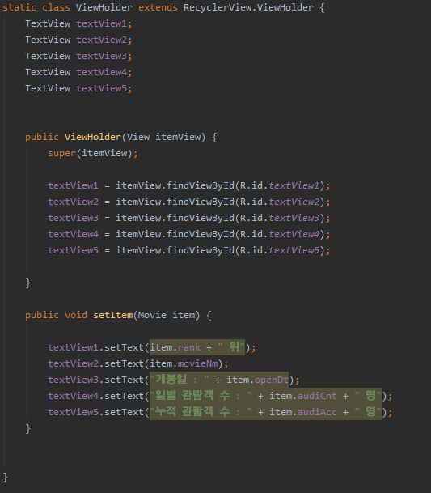
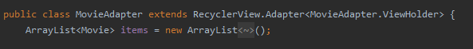
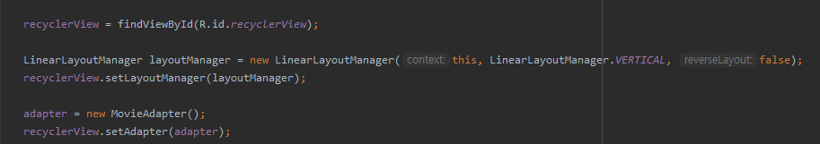

# 프로젝트 명
Daily Box Office TOP10 

# 프로젝트 설명
  오픈API를 이용해 영화 박스오피스를 시각화 하여 나타내기

## 전체적인 프로젝트 요약과 구현방법 

<b>사전에 준비할 것</b>

    영화의 일일 박스오피스 순위의 정보를 가지고있는 오픈API, URL과 Key를 "영화권입장권통합전산망"에서 제공받는다.

    영화권입장권통합전산망 오픈API 페이지 : http://www.kobis.or.kr/kobisopenapi/homepg/apiservice/searchServiceInfo.do
    
<b>JSON형식의 데이터 예시</b>
   </img>
   
   
 <b>프로젝트 구현 전, 요약</b>

전체 프로젝트를 요약하면 , OpenAPI url을 입력상자에 넣고 요청하기 버튼을 클릭해 웹서버를 요청하면 Volley가 받은 요청과 응답을 단순화하여 가져온다. 가져온 응답은 JSON형식의 데이터이기 때문에 이를 gson통해 자바 객체로 바꾸고 그 안에 있는 데이터를 하나씩 꺼내 어댑터에 추가한다. 그 후 어댑터에 리싸이클러뷰 객체를 설정하고 리스트형식으로 시각화하여 박스오피스 정보를 나타내는 프로젝트이다.
 
 <b>프로젝트 구현 시작 </b> 
 
이를 시작하기 위해 웹서버에 요청하고 응답받을 때 volley를 사용하기 때문에 라이브러리에 volley를 꼭 추가해야된다. 추가 후 응답을 받기 위해서는 Request 객체를 만들고 RequestQueue에 넣어주면 큐가 알아서 웹서버에 요청하고 응답까지 받아준다.

이 후 웹으로 응답으로 받은 JSON 결과물을 처리하기 위해 gson을 라이브러리에 추가하고 JSON을 자바 객체로 바꿀 때 필요한 MovieList 라는 클래스를 만들어준다.

<b>[실제MovieList클래스에 적은 코드]</b>

</img>

MovieList 안에는 boxofficeResult라는 변수를 선언해야한다. 이때 주의할 점은 JSON문자열에서의 속성과 같아야 한다.
[MovieListResult는 boxofficeResult를 담아둘 클래스를 정의한 것]

<b>[실제MovieListResult클래스에 적은 코드]</b>

</img>

위에서 만든  boxofficeResult를 담아두기 위해 만든 MovieListResult안에는 배열 안에 다시 객체들이 들어가는 경우를 위한 ArrayList클래스도 만들어 준다.

<b>[실제Movie클래스에 적은 코드]</b>

</img>

마지막 Movie 클래스에서는 JSON문자열 형식의 영화정보를 입력한다.

이제 이것들을 화면에 리스트 모양으로 보여주기 위한 작업을 해야한다. activity_main.xml 파일에 recyclerview를 추가하고 이를 관리할 어댑터를 만들기 위해 MovieAdapter라는 클래스를 생성한다.

<b>[실제MovieAdaptet 클래스에 적은 코드]</b>

</img>

클래스를 만들었으면 그 안에 ViewHoler 클래스를 static으로 정의하고 리스트 형태로 보일 때 각각의 item은 view로 만들어지고 이 item은 ViewHolder에 담기게 된다.
결국ViewHolder안에는 Movie의 객체들이 담기게 되며 setItem()메서드로 인해 Movie 객체를 전달한다.

ViewHolder에 넣어 줄 뷰 객체의 XML 레이아웃의 이름은 movie_item 이라고 정하고 보여질 화면은 cardview를 사용하여 만든다.

<b>[실제 movie_item.xml cardview 코드]</b>

</img>

cardView는 layout_margin 값을 주어 테두리가 띄어지게 만든다.

<b>[실제  MovieAdapter.java 코드]</b>

</img>

이제 MovieAdapter.java에서 아까 만든  MovieAdapter 클래스가 recyclerview.adapter 클래스를 상속하도록 수정한다

</img>

리싸이클러뷰를 위한 어댑터가 만들어졌으면 이 어댑터를 리싸이클러뷰 객체에 설정하고 그 아래에 MovieAdapter 객체를 만들어 setAdapter()를 호출하도록 설정하면recyclerview와 adater가 상호작용하면서 리스트모양으로 보여준다.

버튼을 눌렀을 때 리싸이클러뷰에 보여지는 과정으로 onCreate() 메서드 안에 imagebutton과 Listener를 추가하고 Volley의 RequestQueue 객체를 생성하는 코드를 추가한다.

<b>[실제 MainActivity processResponse 코드]</b>

</img>

마지막으로 사용자가 버튼을 눌러 응답을 받았을 때 호출되는 OnResponse() 안에서는 processResponse()를 호출한다. 이 안에서는 Gson을 이용해 Json 문자열을 MovieList 객체로 변환하며 그 안에 들어있는 Movie 객체들을 하나씩 꺼내어 어댑터에 추가한다. 어댑터를 모두 추가했다면 마지막 줄에 있는 notifyDataSetChanged()메서드를 호출해야 변경 사항이 반영되어 영화 정보가 리싸이클러뷰에 표시된다.

## 응용한 부분

### RecyclerView , cardView  구현

activity_main.xml RecyclerView를 화면으로 끌어와 사용 가능하다. + cardView 도 같은 방법

### 중복 LinearLayout구현

중복 LinearLayout은 하나의 레이아웃 안에 레이아웃을 여러개 만드는 것을 말하고 중복 레이아웃 안에 있는 내용물을 수평,수직의 형태로 정렬할 수 있다.

### TextView구현 

이 프로젝트에서 사용한 TextView는 총 6개로 프로젝트 명, 영화순위, 영화제목, 개봉일, 일별 관람객 수, 누적 관람객 수를 보여준다. 프로젝트 명을 제외한 나머지는 ViewHolder안에 담긴 Movie의 객체들을 전달 받아 TextView로 표시를 해주는 방식이고 이를 화면에 구현 하기 위해서는 MovieAdapter.java 페이지에서 작성하며 findViewById(R.id.textview); 코드를 입력해 xml과 연결시켜야 한다. [위에 MovieAdapter.java코드 참고]

<b>TextView 꾸미기</b>

>1)android:textStyle="bold" 

>2)android:textColor="#E10B0B"

textStyle과 textColor를 활용하여 text를 꾸며 줄 수 있다. 

### Button으로 웹페이지 이동 구현

>public void B1(View V)

>{ Intent myIntent = new Intent(Intent.ACTION_VIEW, Uri.parse("이동할 페이지의 url 입력"));
   startActivity(myIntent);}

movie_item.xml에 들어간 버튼 두 개의 역할은 웹페이지 이동에 목적을 두고있다.
button1은 kobis mobile 페이지로, button2는 kobis mobile 최신상영작 페이지로 이동하는데 구현하는 방법은 OnClick 함수를 지정하는 것이다. 프로그램에서 button1의 OnClick  함수는 B1 으로, button2의 OnClick 함수는 B2로 지정했다. 그 후 MainActivity로 이동해 button1의 OnClick의 함수인 B1을 호출하고 Intent 함수를 myIntent로 불러오는 위와 같은 코드를 작성한다. button2도 같은 방법으로 작성 가능하다.( 단, button2의 함수는 B2 !)

### imeageView 구현

>app:srcCompat="@drawable/이미지이름" 

영화와 관련된 이미지가 어떤것이 있을까 고민하다가 영화하면 빠질 수없는 팝콘이 떠올라 무료 이미지제공 사이트에서 다운받았다. 이를 화면에 나타내기 위해서는 res - drawavble에 이미지를 넣고  이미지를 구현할 레이아웃인 movie_item 에서 ImageView를 추가하고 위와 같은 코드를 작성한다.

### imeagebutton 구현

이미지버튼을 눌렀을 때 입력상자에 입력한 사이트 주소로 웹 요청을 해야하므로 MainActivity.java 파일에서 onCreate() 메서드안에 ImageButton과 setOnClickListener를 추가하고 volley의 RequestQueue 객체를 생성하는 코드를 작성후 makeRequest(), println(),processResponse() 메서드를 정의해준다.

- ### 주의 할 점

1. 앱이 인터넷 권한을 사용하므로 아래의 코드로 AndroidManifest.xml 에서 권한을 추가한다.

>uses-permission android:name="android.permission.INTERNET"

2. 그 후 <application> 안에 아래와 같은 속성을 추가한다.
   
>android:usesCleartextTraffic="true"

3.Volley와 Gson은 외부라이브러리이기 때문에 사용기 위해서는 build.gradle(Module:app) 라이브러리에 아래와 같은 코드를 추가해야한다.

>implementation 'com.android.volley:volley:1.1.0'

>implementation 'com.google.code.gson:gson:2.8.5'

4. activity_main.xml 에서 text 속성 값에 사이트 URL을 미리 넣어 둘 때, URL이 XML 레이아웃 안에 들어갈 때는 & 기호를 인식하지 못하므로 &#38; 기호로 바꾸어 넣어줘야 한다.

>예시 ) c3ca0e&;targetDt=20200101  -> c3ca0e&#38;targetDt=20200101

## 위에 내용을 응용한 새로운 디자인

<b>1.웹 요청 화면 </b>

<b>(왼쪽) 기존 화면  (오른쪽) 변경 화면</b>

</img>
</img>

이 프로젝트 이름인 Daily Box Office TOP10을 맨 위 상단에 textview로 나타내고 기존에 자리를 많이 차지했던 요청하기 버튼을 돋보기 모양으로 된 imageButton으로 깔끔하게 표현했다.

<b>2.영화 정보를 시각화 한 화면</b>

<b>(위) 기존 화면  (아래) 변경 화면</b>

</img>

</img>

기존에는 영화의 제목과 관객수만 보이는 단순한 구조였지만 순위와 개봉일을 추가하고 일별 관람객과 누적 관람객으로 나눠 표시하도록 만들었다. 
그 후 모바일 홈페이지와 최신상영작페이지로 바로갈 수 있는 버튼 두 개를 만들어 사용자들이 더욱 편리하게 이용 가능하도록 만들었다.

## 결과 화면

<b>(오른쪽) 웹 요청 화면 (왼쪽) 요청받아 시각화 된 화면 </b>

</img>
</img>

